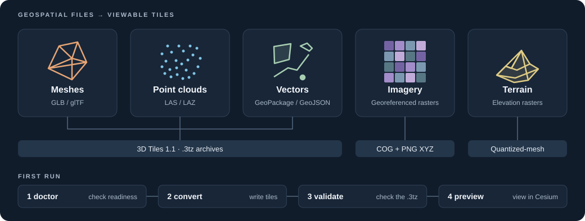

# rusty-tiles

**Turn geospatial files into tiles you can view, share and update.**

rusty-tiles is a local command-line tool and Rust library. It converts textured meshes, point clouds, vector features, imagery and elevation rasters into 3D Tiles, XYZ imagery and quantized-mesh terrain. It runs offline, checks its own readiness, and includes a local Cesium preview. This page is for anyone installing it for the first time.



**MIT licensed** · **Runs locally** · **Version 0.3.0, in development** · [Release notes](CHANGELOG.md) · [Build status](https://github.com/BenDyson-Arch/rusty-tiles/actions/workflows/ci.yml) · [Report an issue](https://github.com/BenDyson-Arch/rusty-tiles/issues)

## Choose a command

| Your data | Command | Output | Needs `native-geospatial` |
| --- | --- | --- | --- |
| Textured GLB or glTF meshes | `mesh-to-3tz` | 3D Tiles with mesh level of detail, as `.3tz` | No |
| LAS or LAZ point clouds | `point-cloud` | 3D Tiles with sampled parents and full-detail leaves, as `.3tz` | Only for globe placement |
| GeoPackage, GeoJSON or Shapefile | `vector` | Experimental glTF vector tiles, as `.3tz` | Yes |
| GeoTIFF or other GDAL imagery | `raster` | Source COG, PNG XYZ tiles and TileJSON | Yes |
| Elevation rasters | `terrain` | Prototype quantized-mesh terrain with height sidecars | Yes |
| An existing model or tileset | `glb-to-3tz`, `createTilesetJson`, `convert` | `.3tz` or `tileset.json`, without new level of detail | No |

Every option for every command is in the [command reference](docs/CLI.md).

## Install

The downloads support mesh tiling, local point clouds, packaging, validation and preview. For georeferenced point clouds, vector, imagery and terrain, use the [container](#run-the-full-toolset-in-a-container) or [build with Cargo](#build-with-cargo).

### macOS / Linux

Run in a terminal:

```sh
curl -fsSL https://raw.githubusercontent.com/BenDyson-Arch/rusty-tiles/main/scripts/install.sh | sh
export PATH="$HOME/.local/bin:$PATH"
rusty-tiles --version
```

This installs the latest release into `~/.local/bin` and verifies its checksum. No Rust or administrator privileges are needed. Add the `export PATH` line to your shell's startup file to keep it in new terminals.

Supports Intel/AMD and ARM64. Requires macOS 15+, or Linux with glibc 2.35+ and libstdc++.

### Windows

1. Open [the latest release](https://github.com/BenDyson-Arch/rusty-tiles/releases/latest) and download `rusty-tiles-VERSION-x86_64-pc-windows-msvc.zip` under **Assets**.
2. Extract the ZIP, then open PowerShell in the extracted folder.
3. Check the executable:

   ```powershell
   .\rusty-tiles.exe --version
   ```

To run `rusty-tiles` from any folder, add the extracted folder to your user `PATH` and reopen PowerShell. The Windows download is for x64.

### Run the full toolset in a container

The published image bundles GDAL and PROJ. No host geospatial libraries are needed. It is a Linux amd64 image; other architectures need Docker's amd64 emulation.

```sh
docker run --rm --platform linux/amd64 --network none \
  ghcr.io/bendyson-arch/rusty-tiles:latest doctor --json

docker run --rm --platform linux/amd64 --network none \
  -v "$PWD:/data" -w /data ghcr.io/bendyson-arch/rusty-tiles:latest \
  vector -i mapping.gpkg -o mapping.3tz --layer roads
```

Replace the example input with a file in the mounted directory. Pin the image to `:v0.3.0` for a repeatable setup. The image contains no datasets, Cesium runtime, Basis Universal encoder or extra datum grids. Mount required grids and set `PROJ_DATA` to include them and `proj.db`.

With a rootful Docker daemon, add `--user "$(id -u):$(id -g)"` so new outputs belong to you. Rootless Docker already maps the container's root user to your account.

### Build with Cargo

You need current stable Rust with Cargo and a C++ compiler. For a default build:

```sh
git clone --branch develop https://github.com/BenDyson-Arch/rusty-tiles.git
cd rusty-tiles
cargo install --path . --locked
```

Add `--features native-geospatial` to enable every converter. This build needs GDAL 3.12+, PROJ 9.2+, GEOS 3.10+ for vector, SQLite, development headers, `pkg-config` and libclang. The same library versions must be present at run time. CI tests GDAL 3.12 and 3.13. PROJ's database and any datum grids must be installed locally; conversion never downloads them.

`develop` holds the development version. For a stable version, use a source archive from [Releases](https://github.com/BenDyson-Arch/rusty-tiles/releases). To build without installing, use `cargo build --release` and run `target/release/rusty-tiles`.

If `pkg-config` finds libjpeg-turbo at build time, it is also needed at run time. Set `RUSTY_TILES_DISABLE_NATIVE_JPEG=1` while building to use the portable Rust encoder, as the release binaries do.

If you already have `cargo-binstall`, run `cargo binstall --manifest-path Cargo.toml rusty-tiles` from a source checkout to download the prebuilt binary instead.

### Build the container

```sh
docker build --target runtime -t rusty-tiles:native .
docker run --rm --network none rusty-tiles:native doctor --json
```

The `Dockerfile` builds a Python-free image with GDAL 3.12.4 and PROJ 9.8.1.

## Quick start

This example works with the prebuilt binary or either Cargo build. It converts a tiny invented pyramid, places it near Brisbane, checks the archive and opens the local viewer. You need `curl`, `unzip` and Node.js with npm for the viewer setup.

### 1. Check readiness

```sh
rusty-tiles doctor --command mesh-to-3tz
```

Look for `mesh-to-3tz: ready`. The default build can run this command without GDAL. `doctor` exits with code 4 if a selected command is missing a dependency.

### 2. Make tiles

Download the example (or copy `tests/fixtures/example.gltf` from a source checkout):

```sh
curl -fsSLo example.gltf https://raw.githubusercontent.com/BenDyson-Arch/rusty-tiles/v0.3.0/tests/fixtures/example.gltf
mkdir -p output
rusty-tiles mesh-to-3tz -i example.gltf -o output/example.3tz \
  --cartographic-position-degrees 153.02 -27.47 0
```

The converter prints what it wrote and the next command. Outputs are not overwritten; choose a new path or add `--force` to repeat the conversion.

### 3. Validate

```sh
rusty-tiles validate output/example.3tz
```

A successful check prints `Validated output/example.3tz: 1 tiles, 1 content references`.

### 4. Preview

Install Cesium once, extract the archive and serve the mesh:

```sh
npm install --prefix target/preview-runtime --no-save --package-lock=false cesium@1.143.0
unzip output/example.3tz -d output/example
rusty-tiles preview --cesium target/preview-runtime/node_modules/cesium/Build/Cesium \
  --mesh output/example
```

Open [http://127.0.0.1:9227/](http://127.0.0.1:9227/). Use **3D mesh extent** to frame the pyramid; press Ctrl+C to stop the server. After the one-time Cesium install, the viewer works offline and needs no ion token.

With the full toolset, try the [invented vector fixture](tests/fixtures/vector.geojson) too:

```sh
rusty-tiles vector -i tests/fixtures/vector.geojson -o output/vector.3tz --max-features 2
rusty-tiles validate output/vector.3tz
```

## Convert your data

Every converter takes `-i` for input and `-o` for output. The file names below are placeholders for your own data.

| Data | Example | Details |
| --- | --- | --- |
| Mesh | `rusty-tiles mesh-to-3tz -i model.glb -o output/model.3tz` | [Mesh guide](docs/FORMATS.md#meshes) |
| Local point cloud | `rusty-tiles point-cloud -i cloud.laz -o output/cloud.3tz --source-crs local` | [Point-cloud guide](docs/FORMATS.md#point-clouds) |
| Georeferenced point cloud | `rusty-tiles point-cloud -i cloud.laz -o output/cloud.3tz --source-crs header --height-offset 0` | [Point-cloud guide](docs/FORMATS.md#point-clouds) |
| Vector layer | `rusty-tiles vector -i mapping.gpkg -o output/mapping.3tz --layer roads` | [Vector guide](docs/VECTOR.md) |
| Imagery | `rusty-tiles raster -i orthophoto.tif -o output/imagery --min-zoom 10 --max-zoom 18` | [Imagery guide](docs/FORMATS.md#imagery) |
| Terrain | `rusty-tiles terrain -i elevation.tif -o output/terrain --max-zoom 14 --height-offset 0 --fill-height 0` | [Terrain guide](docs/TERRAIN.md) |

A height offset of 0 is correct only when source heights are already ellipsoidal metres. Read [Coordinates and height](#coordinates-and-height) before you choose one.

Outputs are never overwritten by default. Add `--force` to replace an existing output after a successful conversion.

To update a vector archive after editing its source, add `--reuse-tileset` with the earlier archive. Unchanged content keeps its bytes and URLs. See [Reuse after edits](docs/VECTOR.md#reuse-after-edits).

## Preview

`preview` serves your outputs and a Cesium runtime on `127.0.0.1:9227`. It needs no Cesium ion token and no external basemap. It offers layer toggles, extent buttons and feature picking.

```sh
unzip output/model.3tz -d output/model
unzip output/cloud.3tz -d output/cloud
unzip output/mapping.3tz -d output/mapping
rusty-tiles preview --cesium target/preview-runtime/node_modules/cesium/Build/Cesium \
  --mesh output/model --point-cloud output/cloud --annotations output/mapping \
  --imagery output/imagery --terrain output/terrain
```

- Extract `.3tz` archives first. Cesium cannot open a `.3tz` directly.
- Select only the layers you have, and at least one.
- Layers align only if they share compatible placement and height references.
- `--host` and `--port` change the address. `--port 0 --json` prints the bound URL as JSON.

The server never lists directories and never downloads a runtime or data. It serves only the directories you select, so point it at generated output.

To use another viewer, serve the extracted `tileset.json` and its files. Raster output uses `tilejson.json`, and terrain output uses `layer.json`.

## Validate and publish

Run `validate` on every `.3tz` before you publish it:

```sh
rusty-tiles validate output/example.3tz
```

It is read-only. It checks the ZIP and 3TZ index, the tileset schema, bounds, geometric error, references, content hashes and recorded budgets. Add `--external-validator` to also run a locally installed official `3d-tiles-validator`. Details are in the [command reference](docs/CLI.md#validate).

`validate` checks `.3tz` archives only. Raster and terrain directories are not validated yet.

Publication is safe by design.

- A failed conversion publishes nothing and removes its work directory.
- Each job works in a private `.tiles-work-*` directory beside the output. Allow scratch disk there.
- Archive replacement with `--force` is atomic.
- Directory replacement swaps in the new output and rolls back on failure. There is a brief rename gap. If the rollback itself fails, the message names the kept backup.

## Coordinates and height

A file's CRS and height reference decide where its content lands. rusty-tiles never guesses a vertical datum.

| Input | Rule |
| --- | --- |
| Mesh | Local model coordinates are placed with `--cartographic-position-degrees lon lat height`. Metashape-style geographic and EPSG:3857 exports are also read. See [mesh placement](docs/FORMATS.md#mesh-placement). |
| Point cloud | `--source-crs local` means metre XYZ with Z up and no globe placement. Geospatial input needs a 2D horizontal CRS and `--height-offset`. |
| Vector | The layer's CRS is used unless `--source-crs` overrides it. 3D data with only a horizontal CRS needs `--height-offset`. 2D data sits at ellipsoidal height zero. |
| Terrain | Heights must be metres. `--height-offset` and `--fill-height` are required. |

A constant height offset is not a geoid transformation. Transformations use only local PROJ operations. A missing grid fails the job, and ballpark operations are refused.

## Library use

Each converter has a `*_reported` function. It takes a `Reporter` for events and returns a `ConversionResult`.

```rust
use rusty_tiles::{tile::mesh_to_3tz_reported, MeshTo3tzOptions, Reporter};

let result = mesh_to_3tz_reported("model.glb".as_ref(), "model.3tz".as_ref(), &MeshTo3tzOptions::default(), &Reporter::silent())?;
println!("wrote {} (archive: {})", result.output.display(), result.archive);
```

`ConversionResult` carries `output`, `archive` and the published `conversion.json` as `report`. `Reporter` can be silent, human text on stderr, NDJSON on stderr, or a custom `EventSink`. The library's `MeshTo3tzOptions::default()` writes lossless PNG textures, while the CLI defaults to JPEG.

## Where to go next

- [Command reference](docs/CLI.md): every option, exit codes, JSON output and progress events.
- [Mesh, point cloud and imagery guide](docs/FORMATS.md): fidelity, limits and advanced options.
- [Vector guide](docs/VECTOR.md): layers, budgets, reuse, styling and picking.
- [Terrain guide](docs/TERRAIN.md): height decisions, sidecars and viewer setup.
- [Contributing](CONTRIBUTING.md): build, test and release.

Licensed under [MIT](LICENSE).
